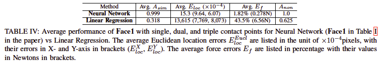

# Instrumented Objects for Assessing Compliant Robotic Grasping
Project page for the paper "Towards assessing compliant robotic grasping from first-object perspective via instrumented objects", which is under review for RA-L.
```
@article{knopke2023towards,
  title={Towards Assessing Compliant Robotic Grasping from First-Object Perspective via Instrumented Objects},
  author={Knopke, Maceon and Zhu, Liguo and Corke, Peter and Zhang, Fangyi},
  journal={arXiv preprint arXiv:2312.14466},
  year={2023}
}
```

Please refer to the paper (https://arxiv.org/abs/2312.14466) for more details.

[](https://www.youtube.com/watch?v=kQSZlNxYRrs)

For fabrication details, please refer to the [fabrication readme](Fabrication_Readme.md).

The full results for the other four faces can be seen in [detailed_results_for_the_other_four_faces.pdf](detailed_results_for_the_other_four_faces.pdf).

## Comparison to Other Methods for Contact Estimation


The linear regression has very poor performance in all metrics, indicating it is not suitable for this contact estimation task.

## Limitations and Future Outlook
The current design generally worked well in contact estimation, although there were some design drawbacks that caused non-trivial performance degradation with simultaneous contacts from multiple faces and the internal core shifting w.r.t. the silicone shell between calibration and evaluation.

This concept and design can be extended in the future for more comprehensive measurements of compliant robotic grasping (such as the measurement of 3D contact force and more simultaneous contact points, and the estimation of deformation and shape changes) with various robotic grippers (such as anthropomorphic robotic hands and soft robotic grippers/hands). Ultimately this could lead to a robust framework for autonomously generating designs of instrumented objects with various measurement capabilities and physical properties (shapes, sizes, stiffness, etc) for benchmark purposes. Such instrumented objects could close the loop of developing/learning solutions for different compliant robotic manipulation tasks by providing timely and accurate feedback from a first-object perspective.

### Use for assessing soft robotic grippers/hands
To be used for assessing soft robotic grippers/hands, the design might need to be adjusted in three aspects:
- collecting additional training data to cover more complicated contact situations with the object,
- denser sensors or more effective sensor layouts for detecting more complicated contacts (e.g., large contact areas that cover many more than three pixels), and
- a softer outer shell to be more sensitive to subtle deformations (depending on how compliant the grippers/hands are).

### Use for assessing grasping by anthropomorphic robotic hands
This instrumented object can be extended for assessing grasping by anthropomorphic robotic hands, but needs additional training data to cover situations different from the three types of probes currently used for training data collection. For better and stabler performance, the current design also needs to be optimized to eliminate the Problems a) and b) discussed in Section VII in the [paper](https://arxiv.org/abs/2312.14466).